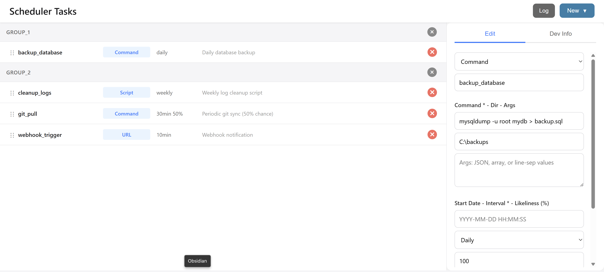

# Scheduler

All in one scheduler

- just run a single script that uses this class in your system's scheduler (less config work)
- configure multiple tasks in yml (syncable on multiple devices)
- also supports advanced features like running a task based on likeliness

```bash

# Demo

> cd debug
> composer install

# Install

> composer require symfony/yaml
```

## Sample

```php

$config    = Yaml::parseFile('config.yml');
$scheduler = new Scheduler( $config['scheduler'], 'cache.json', [
  'user'    => '/home/username',  // placeholders for field file: {user}/file.txt
  'scripts' => '/var/scripts'
], 'myCallback');                 // runs when a task is finished (also for debug use)
                                  // can be used to handle failed tasks, then use override below
try  {
  $scheduler->run([
    'quick_sync' => false         // optional override
  ]);
}
catch( Exception $e ) {
  error_log("Scheduler error: " . $e->getMessage());
  exit();
}
```

**Config**

```yaml

scheduler:

  - type:       Script
    name:       script_task
    file:       "{user}/some_script.php"    # {user} will be replaced
    args:     
      param1:   value1
      param2:   value2
    # startDate: 2025-01-04 18:20:00
    interval:   5sec                        # 5min, 10min, 30min, hourly, daily, weekly, monthly (5sec, 10sec used for debugging)

  - type:       URL
    name:       quick_sync
    url:        http://example.com/quick-sync
    args:       
      action:   sync
      mode:     quick
    interval:   5sec
    likeliness: 50                          # 75% chance of running when due
```

## Fields

- `type`:       Type of task ('URL' or 'Script')
- `name`:       Unique identifier for the task
- `url`:        URL tasks only: Full URL without query
- `file`:       Script tasks only: Script file (supports placeholders)
- `args`:       (Optional) Script args or query parameters
- `startDate`:  (Optional) YYYY-MM-DD HH:MM:SS task will only run from this time onwards
  - you may edit this at any time
  - you may also set this when a task already has been run
- `interval`:   Time interval between runs
- `likeliness`: (Optional) Percentage chance (1-100) of running when due


## Debug out




LICENSE
----------------------------------------------------------

Copyright (C) Walter A. Jablonowski 2024, free under MIT [License](LICENSE)

This app is build upon PHP and free software (see [credits](credits.md))

[Privacy](https://walter-a-jablonowski.github.io/privacy.html) | [Legal](https://walter-a-jablonowski.github.io/imprint.html)
