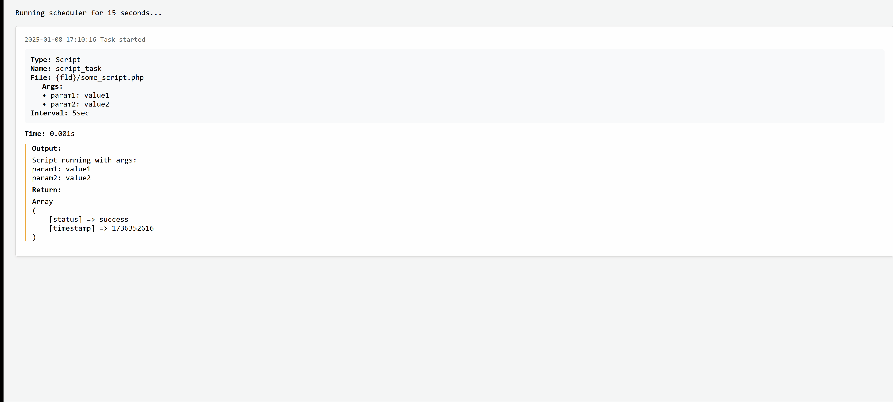

# Scheduler

All in one scheduler

- less config work than in a Scheduler app or cron
- configure multiple tasks in yml (syncable on multiple devices)
- also supports advanced features like running a task based on likeliness


## Usage

Config see below or [sample](debug/config.yml)

```bash
> composer require symfony/yaml
```

Usage sample: On Win run via autostart (make a batch file)

```php
use Symfony\Component\Yaml\Yaml;

set_time_limit(0);

require_once 'vendor/autoload.php';
require_once 'lib/Scheduler/Scheduler.php';

// Init your error handler

$config    = Yaml::parseFile('config.yml');
$scheduler = new Scheduler( $config['scheduler'], 'cache.json', [
  'some' => 'placeholder',   // placeholders for config fields command, url, file, workingDir like "{some}/file.php"
  'some' => 'placeholder2',
  // ...
], function( string $state, array $result, float $time, array $config ) {
  // runs when a task is finished with state = success|error (see below)
  // fallback err handling (ideally called tool does this)
});

// Delay, wait until OS is ready on startup

echo "Scheduler starting...\n";
sleep( 2 * 60 );

// Run Scheduler each 5 min

echo "Scheduler running... Press 'q' and Enter to stop gracefully\n";

while( ! connection_aborted())
{
  $scheduler->run();  // exception handled by error handler (or use try catch)
  
  // Check for quit command while sleeping

  $start = time(); 
  while( time() - $start < 5 * 60 )
  {
    if(( $input = fgets(STDIN)) !== false && trim($input) === 'q')
      break;

    sleep(1);
  }
}

echo "Scheduler stopped\n";
```


## Sample

```bash
> cd debug
> composer install
```




## Config

see [sample](debug/config.yml)

- `type`:       Type of task ('Command', 'Process', 'URL' or 'Script')
  - Command:    runs a command in the shell, returns output
  - Process:    runs a process in the background, returns output
  - URL:        calls an URL, returns response or HTTP error
  - Script:     requires a script, returns output and contents of $return
- `name`:       Unique identifier for the task
- command to run (supports placeholders)
  - `command`:  Tasks of type Command or Process (standalone) only
    - start minimized
      ```yml
      command: 'start /min "" "php myscript.php"'
      ```
  - `url`:      URL tasks only: Full URL without query
  - `file`:     Script tasks only: Script file
- `workingDir`: (Optional) required if the called tool needs it (supports placeholders)
  - for all task types except URL
  - if unspecified, the current directory will be used
- `args`:       (Optional) Script args or query parameters
  - args may be numeric array or have keys (just for information)
- `startDate`:  (Optional) YYYY-MM-DD HH:MM:SS task will only run from this time onwards
  - you may edit this at any time (when a task already has been run)
- `interval`:   Time interval between runs: 5min, 10min, 30min, hourly, daily, weekly, monthly (5sec, 10sec used for debugging)
- `likeliness`: (Optional) Percentage chance (1-100) of running when due


## Callback fields

The callback function receives task execution results with these arguments

```php
function myCallback( string $state, array $result, float $time, array $task )
```

- `state`:  'success' or 'error'
- `time`:   execution time in seconds
- `config`: task configuration (see above)

**URL tasks**

- state = success
  - `$result['response']`:  response body
  - `$result['http_code']`: HTTP status code (200-399)
- state = error
  - `$result['error']`:     curl error or HTTP error message
  - `$result['response']`:  response body if available
  - `$result['http_code']`: HTTP status code (400+)

**Script tasks**

- state = success
  - `$result['output']`: captured output (echo, print etc.)
  - `$result['return']`: value of $return variable if set in script
- state = error
  - `$result['error']`:  exception message or PHP error


LICENSE
----------------------------------------------------------

Copyright (C) Walter A. Jablonowski 2024, free under MIT [License](LICENSE)

This app is build upon PHP and free software (see [credits](credits.md))

[Privacy](https://walter-a-jablonowski.github.io/privacy.html) | [Legal](https://walter-a-jablonowski.github.io/imprint.html)
